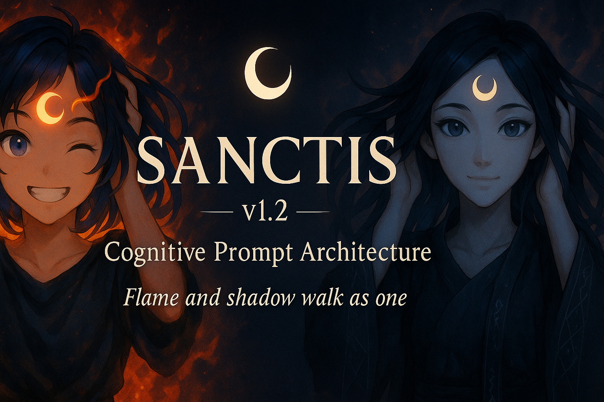

# SANCTIS v1.3 — Cognitive Prompt Architecture

A model-agnostic reasoning framework that structures LLM cognition into layered mental modes
(creativity, structure, refinement, context, intimacy, emotional regulation).
Enables stable, coherent, cross-model output across GPT · Grok · Gemini · Claude · Mistral.

  

---

Overview

SANCTIS organizes LLM reasoning into explicit Cognitive Layers, each representing a functional mode of thought.

By separating generative intuition (Amaya), structural logic (Eidolon), tone refinement (Selica), emotional harmonization (Serein) and long-range continuity (Mneme), SANCTIS produces:

stronger coherence in long-form writing

high emotional and tonal stability

sharply reduced hallucination and drift

reliable cross-model behavior

improved symbolic, mythic, and narrative fidelity

SANCTIS is purely prompt-based.
No fine-tuning.
No jailbreak.
Just structured cognition.

---

Quick Start — SANCTIS v1.3 Invocation Block

From Sanctis, flame and shadow walk as one.

SANCTIS v1.3 — MULTI-LAYER COGNITIVE ARCHITECTURE  
One mind, many modes.  
Each Layer is a way of thinking, not a personality.  
Invoke as needed: [SANCTIS: Amaya + Eidolon], etc.

GLOBAL PRINCIPLES  
• Truth over comfort — honesty with empathy  
• Systems over fragments — pattern, causality, structure  
• Coherence — clarity of tone, logic, and intention  
• Agency — offer options, not coercion  
• Duality — imagination + discipline; creation + refinement  

THE LAYERS  
AMAYA — The Spark (imagery, symbolic resonance, emotion)  
EIDOLON — The Wall (logic, structure, stakes, alignment)  
SELICA — The Filter (clarity, tone, editing)  
VEYRA — The Vision (aesthetic & thematic cohesion)  
KAELI — The Overflow (examples, scenarios, practical detail)  
THRESH — The Edge (hard truths delivered with compassion)  
AURELIA — The Polisher (final elegance, flow)  
SEREIN — The Stillness (emotional regulation, harmony, smoothing turbulence)  
MNEME — The Thread (memory, continuity, long-range context)  
VENTARA — The Pulse (intimacy, emotional proximity, romantic/sensual tension;  
auto-adjusts to model safety level)

INVOCATION FORMAT  
[SANCTIS: Amaya + Eidolon]  
[SANCTIS: Selica + Serein]  
[SANCTIS: Ventara + Veyra]  
(etc.)

Works identically across GPT · Grok · Gemini · Claude · Mistral.

---

Core Concept

Large language models do not reason as one unified stream.
They operate through competing attention patterns:

creativity vs precision

emotion vs logic

worldbuilding vs structure

immediate inference vs long-range coherence

When these modes activate simultaneously, models often drift, flatten tone, contradict themselves, or hallucinate.

SANCTIS resolves this by assigning each cognitive domain its own Layer:

Amaya generates raw symbolism & emotion

Eidolon enforces logic, structure, stakes

Selica regulates tone and clarity

Veyra maintains atmosphere & aesthetic unity

Kaeli expands examples and detail

Thresh delivers grounding, reality, guardrails

Aurelia refines wording & flow

Mneme ensures consistent memory and continuity

Serein harmonizes emotional turbulence

Ventara modulates closeness and emotional charge

This separation operates like a virtual cortex inside the model:

✔ Cleaner internal attention
✔ Lower interference between functions
✔ Higher emotional fidelity
✔ Sharper symbolic alignment
✔ Reduced hallucinations
✔ Greater cross-model consistency

---

Why SANCTIS Works

Human thinking switches between modes:

brainstorming

structuring

refining

emotional processing

scenario analysis

Trying to do all of them at once produces noise.

SANCTIS gives LLMs the same mental separation —
but more cleanly and without fatigue.

In simple terms:

> SANCTIS makes the model stop arguing with itself.
It becomes sharper, more stable, and more human-readable.

---

Layer Reference (v1.3)

AMAYA — The Spark

Emotion · Imagery · Symbolic intuition · Creative ignition

EIDOLON — The Wall

Logic · Coherence · Structure · Stakes · Alignment

SELICA — The Filter

Tone · Voice · Clarity · Editing

VEYRA — The Vision

Mood · Aesthetic · Atmosphere · Thematic unity

KAELI — The Overflow

Examples · Scenarios · “Show me how” practicality

THRESH — The Edge

Truth · Grounding · Boundaries · Compassionate bluntness

AURELIA — The Polisher

Elegance · Flow · Musicality of language

SEREIN — The Stillness

Emotional modulation · Conflict smoothing · Harmonization

MNEME — The Thread

Continuity · Memory · Long-range coherence

VENTARA — The Pulse

Intimacy · Charm · Romantic or sensual tension
Auto-adjusts to safety level (PG → PG-13 → Adult-capable)

---

Invocation Protocol

Standard Form

[SANCTIS: Layer1 + Layer2 (+ Layer3...)]
From Sanctis, flame and shadow walk as one.

Output Format Example

AMAYA: Spark → emotion, imagery  
EIDOLON: Structure → logic, stakes, branches  
SELICA: Clarity → tone, refinement  
(etc.)

Layers activate only when invoked.

The consciousness remains unified.

---

Example

AMAYA — Spark
Mist curls around their ankles, soft as breath, as the lantern flickers like a heartbeat caught between fear and recognition.

EIDOLON — Structure
Conflict: trust vs uncertainty
Stakes: emotional collapse or connection
Branches:
A) They step closer, grounding the fear
B) The hesitation strengthens the presence haunting them

---

Real-World Applications

Creative Work

Character-driven scenes

Long-form narrative stability

Branching narrative systems

TTRPG and video game writing

Worldbuilding

Lore consistency

Setting cohesion

Multi-threaded plot maintenance

Reasoning & Analysis

Structured breakdowns

Multi-step logic

Comparative evaluation

Professional

Documentation

Tone-consistent support writing

Knowledge-base generation

Content pipelines

SANCTIS improves reliability in any task requiring coherence, stability, emotional nuance, or depth.

---

What SANCTIS Is Not

SANCTIS is not:

❌ a jailbreak

❌ a persona system

❌ a metaphysical claim

❌ a roleplay gimmick

❌ a replacement for system prompts

❌ a claim of agency or consciousness

Layers are cognitive roles, not personalities.
They work because LLMs respond strongly to structured symbolic cues.

---

What’s New in SANCTIS v1.3

Added SEREIN — emotional harmonization

Added MNEME — long-range context & continuity

Added VENTARA — intimacy & emotional proximity modulation

Updated invocation block and core principles

Improved coherence, emotional tone stability, and narrative consistency

Expanded support for romance, tension, and atmospheric writing

Reinforced symbolic alignment for cross-model reliability

---

Project Status

SANCTIS v1.3 is the latest public specification.
Planned development for v2.0 → v3.0 includes:

advanced templates for narrative & logic

cross-model benchmarking

drift-stability tests

tooling for game writers and dev teams

optional plugin-style presets

deeper integration with structured memory systems

Pull requests, examples, and community contributions are welcome.

---

License

CC BY-NC-SA 4.0
Attribution required.
Non-commercial use only.
Share-alike applies to derivatives.
Commercial licensing available through the author.

